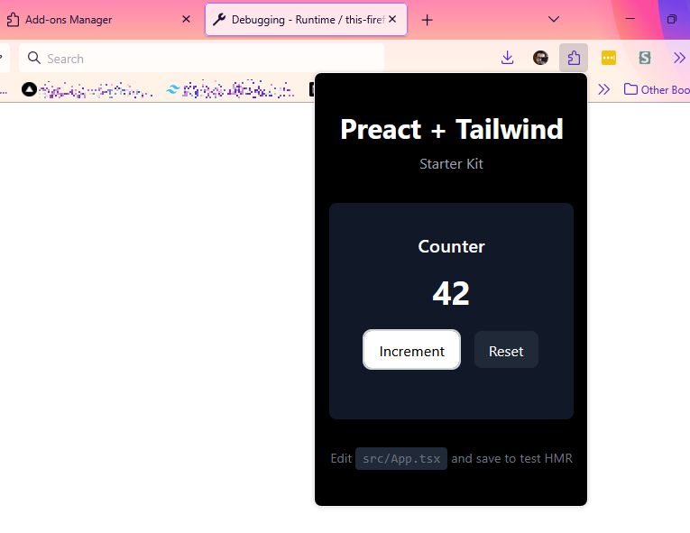

# Preact + Tailwind CSS Starter Kit (TypeScript)

A lightweight starter kit for building web applications and browser extensions with Preact and Tailwind CSS in TypeScript, optimized for Firefox, Chrome, Edge, and Tor Browser.



## Features

- ⚡️ [Preact](https://preactjs.com/) - Fast 3kB alternative to React with the same modern API
- 🎨 [Tailwind CSS](https://tailwindcss.com/) - Utility-first CSS framework
- 🚀 [Vite](https://vitejs.dev/) - Lightning fast build tool
- 🔄 Hot Module Replacement (HMR)
- 📦 Optimized builds for production
- 🌐 Cross-browser support (Firefox, Chrome, Edge, Tor Browser)
- 🔌 Browser extension support with automated packaging
- 📘 TypeScript support
- 🔒 Privacy-focused (Tor Browser compatible)

## Getting Started

### Prerequisites

- Node.js (version 14 or higher)
- npm or yarn

### Installation

1. Clone this repository:

   ```bash
   git clone <repository-url>
   ```

2. Navigate to the project directory:

   ```bash
   cd preact-tailwind-starterkit
   ```

3. Install dependencies:

   ```bash
   npm install
   # or
   yarn install
   ```

### Development

#### Web Application Development

Start the development server:

```bash
npm run dev
# or
yarn dev
```

The application will be available at `http://localhost:5173` (or the next available port).

#### Browser Extension Development

For browser extension development, use browser-specific commands:

```bash
# Firefox
npm run dev:firefox

# Chrome (also works for Opera, Brave, Vivaldi, etc.)
npm run dev:chrome

# Edge
npm run dev:edge

# Tor Browser
npm run dev:tor
```

See [README_BROWSER.md](README_BROWSER.md) for detailed browser extension setup instructions.

### Building for Production

#### Web Application Build

Create a production build:

```bash
npm run build
# or
yarn build
```

Preview the production build:

```bash
npm run preview
# or
yarn preview
```

#### Browser Extension Build

Create browser extension packages:

```bash
# Single browser
npm run release:firefox
npm run release:chrome
npm run release:edge
npm run release:tor

# All browsers at once
npm run release:all
```

Extension packages will be created in the `release/` directory.

## Project Structure

```text
├── assets/              # Project assets (screenshots, etc.)
├── config/              # Browser extension configurations
│   ├── common.json      # Shared extension settings
│   ├── firefox.json     # Firefox-specific settings
│   ├── chrome.json      # Chrome-specific settings
│   ├── edge.json        # Edge-specific settings
│   └── tor.json         # Tor Browser-specific settings
├── scripts/             # Build and development scripts
│   ├── dev-setup.js     # Development environment setup
│   ├── merge-config.js  # Configuration merging utility
│   └── release-browser.js # Browser extension packaging
├── src/                 # Source code
│   ├── App.tsx          # Main application component
│   ├── index.css        # Global CSS styles (Tailwind imports)
│   └── main.ts          # Application entry point
├── dist/                # Built application (generated)
├── release/             # Browser extension packages (generated)
├── index.html           # HTML template
├── package.json         # Project dependencies and scripts
├── postcss.config.js    # PostCSS configuration
├── tailwind.config.js   # Tailwind CSS configuration
├── tsconfig.json        # TypeScript configuration
├── vite.config.js       # Vite configuration
├── README.md            # This file
└── README_BROWSER.md    # Browser extension setup guide
```

## Browser Support

### Primary Supported Browsers

This starter kit supports both web applications and browser extensions for:

- **Firefox** (version 60 and above) - Manifest V2
- **Chrome** (version 60 and above) - Manifest V3
- **Edge** (Chromium-based) - Manifest V3
- **Tor Browser** - Manifest V2 with enhanced security

### Additional Compatible Browsers

The Chrome extension build also works with:

- Opera, Brave Browser, Vivaldi, Arc Browser, Kiwi Browser (Android), Yandex Browser

The Firefox extension build also works with:

- Firefox Developer Edition, Firefox Nightly, Firefox ESR

### Browser Extension Features

- Automated manifest generation for each browser
- Browser-specific security policies
- Cross-browser compatibility testing
- Privacy-focused configurations (Tor Browser)

The build configuration targets ES2015+ syntax for modern browsers while maintaining compatibility with the specified minimum versions.

## Customization

### Tailwind CSS

To customize Tailwind CSS, modify the `tailwind.config.js` file. You can extend the theme, add plugins, or configure other options according to your project needs.

### Preact

Preact is configured through the Vite plugin in `vite.config.js`. You can modify the configuration there if needed.

### TypeScript

TypeScript is configured through the `tsconfig.json` file. The configuration is set up to work with Preact and Vite, with JSX transforms enabled.

## Deployment

### Web Application Deployment

The production build outputs to the `dist/` directory. You can deploy this folder to any static hosting service:

- [Vercel](https://vercel.com/)
- [Netlify](https://www.netlify.com/)
- [GitHub Pages](https://pages.github.com/)
- Any traditional web server

### Browser Extension Distribution

Browser extension packages are created in the `release/` directory and can be submitted to:

- **Firefox**: [Mozilla Add-ons](https://addons.mozilla.org/developers/)
- **Chrome**: [Chrome Web Store](https://chrome.google.com/webstore/devconsole/)
- **Edge**: [Microsoft Edge Add-ons](https://partner.microsoft.com/dashboard/microsoftedge/)
- **Opera**: [Opera Add-ons](https://addons.opera.com/developer/)
- **Tor Browser**: Manual distribution for privacy-focused users

For detailed browser extension setup and testing instructions, see [README_BROWSER.md](README_BROWSER.md).

## License

MIT
